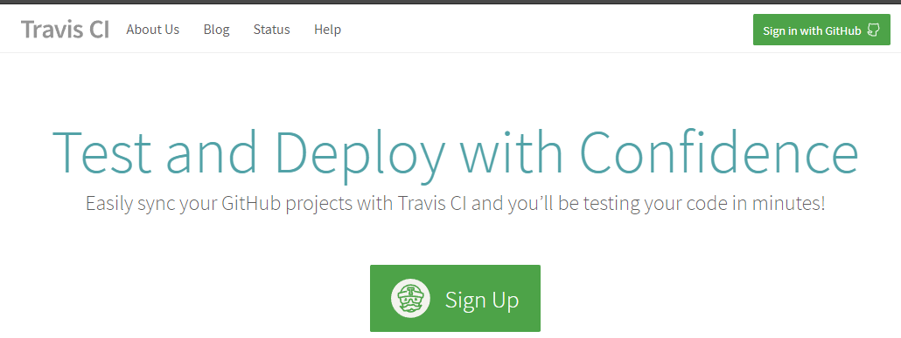
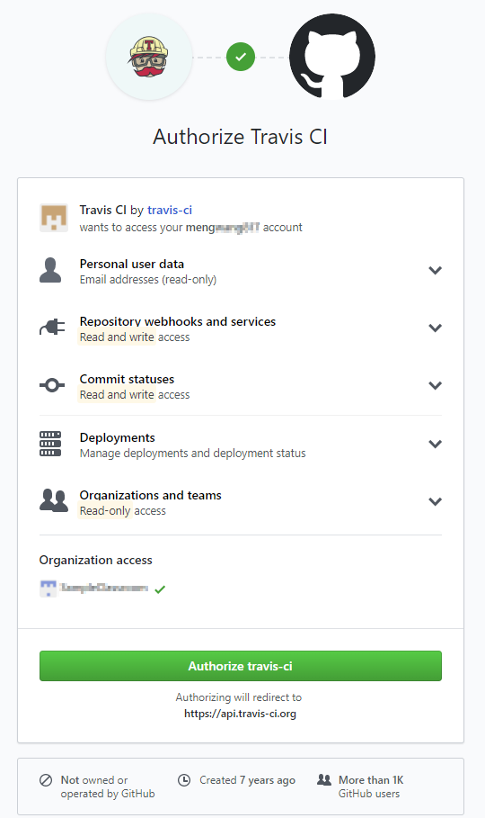
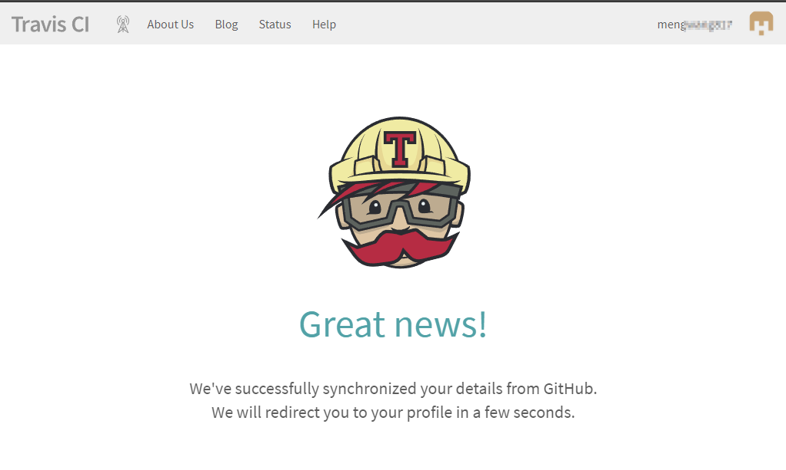
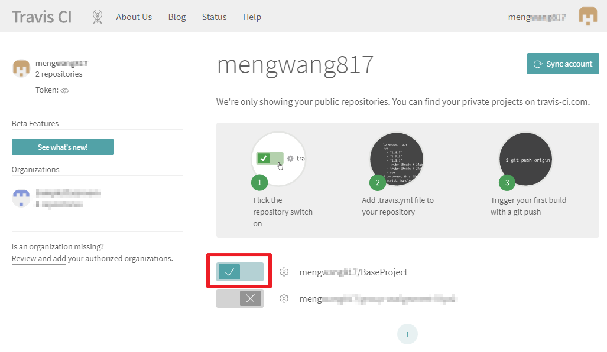
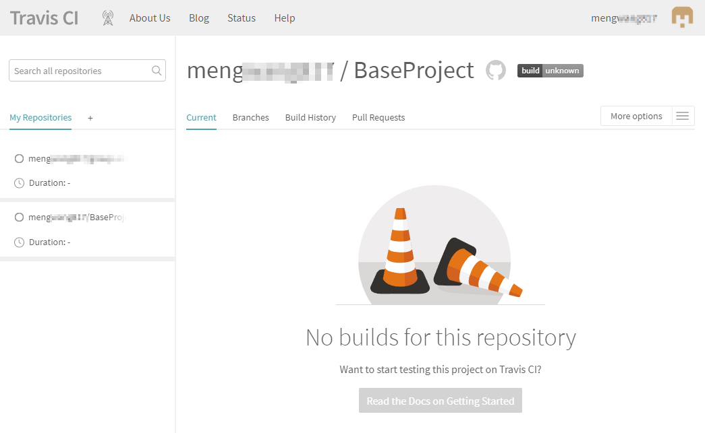
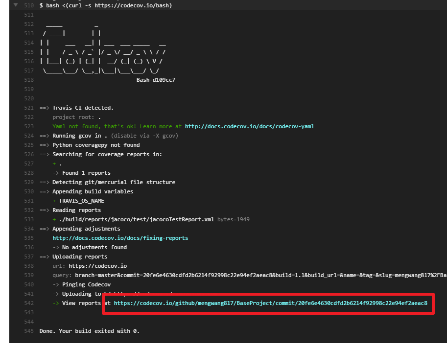
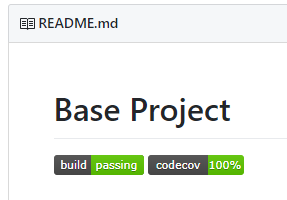

# Travis CI 自動建置與測試
若一個專案由多人共同開發，可能會相依到別人的程式碼，在自己的電腦測試通過，並不代表上線後就沒問題。  
Travis CI 與 GitHub 高度整合，只要將程式碼 push 到 Github，Travis CI 即可自動從 GitHub 抓取最新版的程式碼，並進行自動測試。

## 啟用 Travis CI 專案
雖然 Travis CI 與 GitHub 有整合，但所有專案預設都是不會啟用 Travis CI 的自動測試，我們需要先手動為專案進行啟用的動作。
1. 進入 Travis CI 網站：[https://travis-ci.org/](https://travis-ci.org/)。  

2. 點擊右上方的 `Sign in with GitHub` 。  

3. 確認授權細節後，按下 `Authorize travis-ci` 即可登入網站。  

4. 點擊右上方的帳號或頭像，即可看到專案清單，請點擊 `BaseProject` 專案左側的小開關，啟用該專案。  

5. 點擊專案名稱，進入專案頁面  

6. 基本上已經告一段落了，若想調整細部設定，可點擊右上角 `More options` 中的 `settings`

## 自動測試
由於自動測試是由 push 的動作進行觸發，一開始並不會主動進行測試，但之後每次 push 接會自動進行測試。
1. 如同往常的撰寫單元測試與修改程式碼
2. 進行 git push 後，Travis CI 將會自動開始測試  

3. 看到顯示綠色勾勾，表示已經通過測試  

4. 同時可以在最下方按到覆蓋率報告的網址  

## 在專案顯示建置與測試狀態
若想在 GitHub 專案的 README 頁面顯示建置與測試狀態，可照以下動作進行。
1. 將 `README.md` 檔案最上方的部分，出現的四個 `1071-FCU-SE/BaseProject` 改為自己的專案路徑  

2. 修改後，即可於 `README` 頁面，看到建置與測試狀態、程式碼覆蓋率之圖片  

